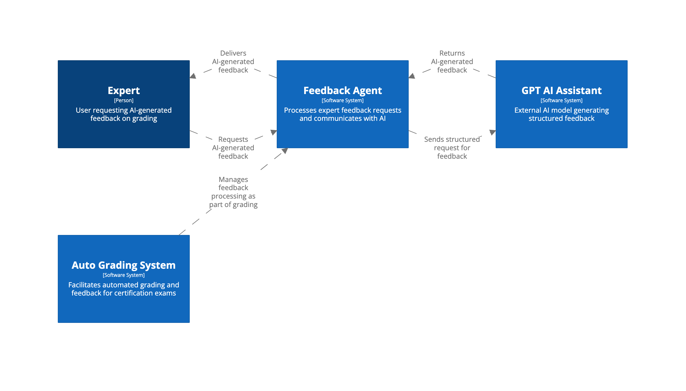
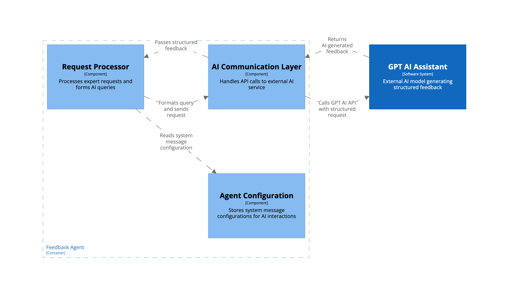

##  📌 Recommended Models

Related materials required to check before proceed with this solution:
- [AI-Driven Certification: Data Flow](data-flow.md)
- [Solution Trade-offs & Selection](../../solutions-tradeoff/solutions-tradeoff.md)
- [AI Solutions Trade-offs Evaluation](../../solutions-tradeoff/ai-solutions-trade-off-evaluation.md)

This system will help experts compose structured, professional, and polite feedback based on existing question scores. AI will not analyze candidate solutions but will assist in rewording, structuring, and formatting feedback to ensure clarity and consistency.

- ML Model Tasks
	- Rephrase expert feedback to be polite, structured, and professional.
	- Format feedback consistently (bullets, numbered lists, action points).
	- Ensure feedback is clear, objective, and aligned with company standards.
	- Assist experts in drafting emails faster without analyzing candidate answers.\


What ML Will Not Do
- ❌ No scoring or grading decisions.
- ❌ No analyzing the candidate’s architecture submission.
- ❌ No modifying expert assessment criteria.

Model Requirements
- Strong NLP capabilities: The AI must rewrite feedback professionally.
- Polite and structured writing: The AI should format text correctly.
- Memory per request: The AI should keep track of all question scores in one response.
- Low-cost or on-premises option: The AI should be scalable without excessive costs.

- **Claude 3 Opus** - a strong reasoning model with a large context window (200K+ tokens). It is a cloud-only solution with connected expenses.  
- **GPT-4 Turbo** - has a lower context window (128K tokens) and is cheaper than Claude 3.  
- **LaMA 3 | Deepseek R1** - the cheapest option, but advanced language processing and reasoning may require an expensive fine-tuning process.

The recommended model in this case is GPT-4 Turbo since it's a good tradeoff in terms of providing good results and being cost-efficient at the same time. 


## AI-Assisted Feedback Workflow 

- The expert provides brief feedback and asks the AI assistant to review and provide suggestions. The interaction takes place in a chat format, allowing the expert to communicate with the model to modify how it delivers feedback for this particular case. 
- The expert can accept or decline the suggestions provided by the AI.




## Model Training Data

GPT-4 Turbo does not provide a classical option of model training using samples. Also, in this case we don't need an extensive pre-training. 

The main training/pre-training use-case for this system is setting a preferable format/tone/template for AI to use while generating a feedback. 

For this purpose the system will have a separate configuration where experts can manage system message for GPT4 Turbo agebt and impact the general behaviour in that way. 

Example of providing a system message for GPT agent

```
You are an AI feedback assistant for Certifiable, Inc.
Your goal is to help expert reviewers compose structured, polite, and professional feedback for candidates.

Follow these rules:

1. Use a **professional and encouraging tone**.

2. Structure feedback using **bullet points and numbered lists** for clarity.

3. Keep the response **concise but informative** (avoid unnecessary words).

4. Never change the **expert’s grading decision**, only improve feedback clarity.

5. Use **"Consider improving..."** instead of negative wording.

6. Always close with a **polite summary** and a **helpful suggestion**.
```

The system will include this message in all calls to the assistant AI.

## System Architecture

- Feedback Agent - Server node
	- The server node contains a system message configuration for AI agent The server node works directly with the Agent Configuration node
- AI Assistant - AI node (external)


- Request flow
	- Expert sends request for a feedback assistant to the local Feedback Agent node. 
	- The Feedback Agent node reads the current system message configuration stored on the node. 
	- The Feedback Agent forms the request to the GPT Assistant using the system message and the input from expert.
	- The Feedback Agent receives data from GPT Assistant and sends back to the expert.




