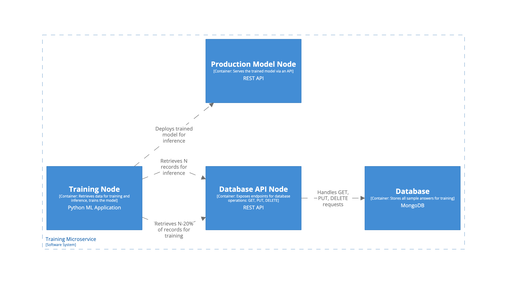

##  📌  Recommended Models

Related materials required to check before proceed with this solution:
- [AI-Driven Certification: Data Flow](data-flow.md)
- [Solution Trade-offs & Selection](../../solutions-tradeoff/solutions-tradeoff.md)
- [AI Solutions Trade-offs Evaluation](../../solutions-tradeoff/ai-solutions-trade-off-evaluation.md)

For pre-grading short-answer questions in Test 1, we used the following criteria for choosing a model:

- **Accuracy** – Can evaluate structured, technical responses.
- **Cost-efficiency** – Runs **locally** with minimal infrastructure costs.
- **Inference speed** – Processes answers in real-time or near-real-time.
- **Adaptability** – Can be fine-tuned on grading data.

Possible candidates: 

- LLaMA 3 7B - provides the most accuracy, but requires more computing power.
- Mistral 7B - less accurate, but might be more performant. 
- Phi-2 - fewer capabilities in terms of processing nuanced answers, but in this particular case does not require processing complex responses

Considering cost-efficiency, it's recommended to test the Phi-2 model as a first stage and move to more complex models if Phi-2 does not show sufficient results. 

## Model Training Data 

- **Historical Expert-Graded Responses**
	- Candidate answer
	- Expert score 
	- Feedback comments
	- Multiple correct answers - Different valid ways of answering the same question

| Question                          | Candidate Answer                                       | Score | Expert Feedback                                                      |
| --------------------------------- | ------------------------------------------------------ | ----- | -------------------------------------------------------------------- |
| Explain microservices.            | Microservices split an app into independent services.  | 8/10  | Correct but lacks mention of API communication and scaling benefits. |
| Define event-driven architecture. | It’s a system where components communicate via events. | 10/10 | Complete and well-explained answer.                                  |

This data can be represented as JSON or any other structured data format

For fine-tuning the model, a few thousand labeled examples is ideal, but we may start with as few as 1000-2000 high-quality expert-graded responses. 

## Model Training Process (first time)

### Preparation

- Collect historical data of responses 
- Format responses into a structured data 
- If the dataset is too small (< 1000 samples) generate more labeled data using LLM-assisted variations 
- Remove duplicates and other noise

### Training

- Use [Hugging Face Transformers library](https://huggingface.co/microsoft/phi-2) 
- Use Nvidia A100 GPU
- Create the training routine, based on the transformers, adjust the training parameters
- Train the model
- Perform the model inherence 
	- Use 20% of unseen data in the dataset

## Data Collection Pipeline 

The task is to architecture a system that can continuously learn the new data 

- When expert reviews short answers manually, he sees the score provided by AI as well. Also, we may show a feedback regarding the answer from AI.
- If the expert accepts the grading and feedback from AI, he has an option to "Accept" the answer from AI.
- Once the answer is accepted, it will go to the database with training data for further re-training.
- The re-training process may be executed on a scheduled basis once per month. 
	- The ideal case scenario is to implement a system on top of it which will analyse the AI efficiency and run re-training automatically on demand. But this implementation will add additional expenses without providing a significant value. If a more complex system is required, it can be implemented in the later stages. 

### Model Deployment

- Deploy the new model on-prem on the infrastructure.
- Expose the model via API (Flask)

## System Architecture

The training microservice consists of two application nodes and one database node (MongoDB).

- The database stores all the sample answers for training.
- The first application node is the database API node. The API exposes three endpoints for working with the database records:
  - GET: Retrieve all records from the database using a search criteria.
  - PUT: Store a new record.
  - DELETE: Remove a record.
- The second application node is the training node.
  - Training part: This application communicates with the database via the API node.
    - The system retrieves N - 20% of the records from the database via the API for training.
    - The system trains the model.
    - The system retrieves N number of records from the database via the API for inference.
- The third node is the production model node, which is exposed via an API.

- Model Training Flow
    - Initial
        - Collect historical expert-graded responses (1000+).
        - Triage responses and remove noise.
        - Populate the training database with the responses
    - Consecutive
        - Run the training process using 80% of the samples in the database.
        - Run the inference process for model validation using 100% of the samples in the database.

