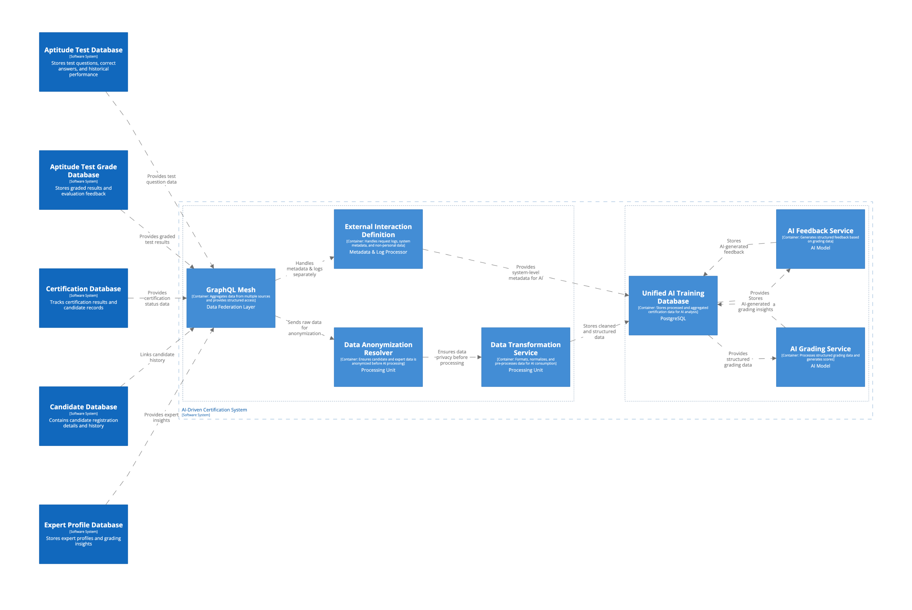

# AI-Driven Certification: Data Flow

## 📌 Overview

The AI-driven certification system relies on data from multiple sources, including candidate submissions, grading results, 
and expert evaluations. To efficiently manage and structure this data, the system implements GraphQL Mesh as a federation 
layer, aggregating and unifying access across different databases. You can check details in ADR [AI-Driven Certification Data Strategy](../../adr/0009-perimeter-definition-ai-driven-certification-data-strategy.md)

This document outlines how data flows through the system, from its initial sources to AI-driven grading and feedback processing.

---

## 📌 Data Sources & Aggregation

### 🗂 External Data Sources

The certification system ingests information from multiple structured databases, each serving a distinct function:

- **Aptitude Test Database** – stores test questions, correct answers, and historical performance metrics
- **Grading Database** – contains grading results, including candidate scores, evaluator feedback, and AI-generated insights
- **Candidate Database** – maintains candidate profiles, registration data, and exam attempt history
- **Certification Database** – tracks certification progress, completion status, and issued certificates
- **Expert Profile Database** – stores information about evaluators, including their expertise and past grading activity

Each of these databases is part of the existing certification system and operates independently. However, they must
be combined into a structured data access layer to support AI-based grading and feedback generation.

---

## 🏗 GraphQL Mesh: Data Federation Layer

At the core of our data unification strategy, GraphQL Mesh stands as a crucial component that effectively eliminates
rigid data dependencies, paving the way for scalable, flexible, and highly efficient AI-driven certification processing.
This layer guarantees structured and swift data retrieval across multiple sources, while also allowing for seamless adaptability to future enhancements.

- **Unifying Data Access** – aggregating multiple databases under a single API
- **Schema Normalization** – transforming different database structures into a common schema
- **API Extensibility** – supporting REST, GraphQL, and direct database connections
- **Filtering & Transformation** – preparing structured outputs for AI models

With GraphQL Mesh, the system eliminates rigid data dependencies, allowing scalable, flexible, and efficient AI-driven certification processing.

---

## 🔐 Data Anonymization & AI Processing

Before AI services analyze data, a dedicated anonymization resolver ensures compliance with privacy regulations and ethical AI practices by:

- **Removing Personally Identifiable Information (PII)** – anonymizing candidate details before processing
- **Masking Sensitive Evaluator Data** – ensuring fair and unbiased AI-driven assessments
- **Filtering Unnecessary Metadata** – optimizing the dataset for AI training and real-time evaluation

Once anonymized, structured data is stored in the Unified AI Training Database, which serves as the primary repository
for AI-driven grading and feedback.

---

## ✅ Summary

- **Multiple databases** supply raw certification data
- **GraphQL Mesh** aggregates and normalizes this data into a unified access layer
- **Anonymization processing** ensures compliance before AI usage
- **AI services** retrieve structured data for grading and feedback

